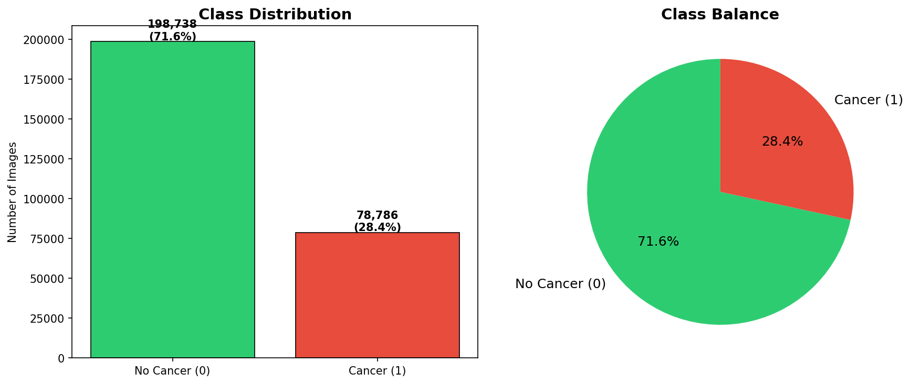
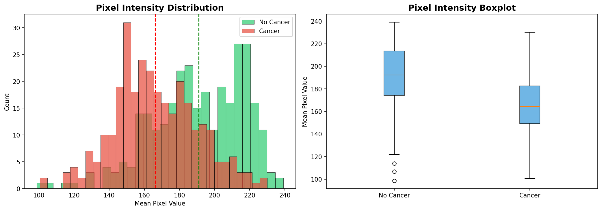

# Breast Cancer Detection AI

[](https://huggingface.co/Abdulhaque/breast-cancer-detection)
[](https://huggingface.co/spaces/Abdulhaque/cancer-detection-app)
[]()
[]()

An advanced deep learning system for **Invasive Ductal Carcinoma (IDC)** detection from breast histopathology images. Designed for hospital deployment.

---

## Live Demo

Try it here: https://huggingface.co/spaces/Abdulhaque/cancer-detection-app

Upload a histopathology image and get instant results with Grad-CAM visualization!

---

## Model Performance

| Metric | Value |
|--------|-------|
| AUC-ROC | 0.9432 |
| Sensitivity (Recall) | 94.64% |
| Specificity | 76.13% |
| F1 Score | 0.78 |
| Test Accuracy | 86% |
| Optimal Threshold | 0.3 |

Threshold optimized at 0.3 for maximum sensitivity.

---

## Dataset

- Dataset: IDC Breast Histopathology Images
- Total Images: 277,524
- Image Size: 50x50px patches (resized to 96x96)
- Classes: IDC Positive (Cancer) | IDC Negative (No Cancer)
- Split: 70% Train | 15% Val | 15% Test (Patient-wise stratified)

---

## Architecture

- Base Model: DenseNet121 (ImageNet pretrained)
- Head: GAP -> BatchNorm -> Dense(256) -> Dropout(0.5) -> Dense(128) -> Dropout(0.3) -> Sigmoid
- Phase 1: Frozen base, train head (LR=1e-4, 15 epochs)
- Phase 2: Fine-tuning (LR=1e-5, 10 epochs)
- Loss: Binary Crossentropy
- Augmentation: Flip, Rotation, Brightness, Contrast, Color Jitter

---

## Sample Images

### Cancer vs Normal Tissue


### Class Distribution


### Pixel Intensity Analysis


### Augmentation Pipeline


---

## Quick Start

### 1. Install dependencies
```bash
pip install -r requirements.txt
```

### 2. Download model
```python
from huggingface_hub import hf_hub_download
model_path = hf_hub_download(
    repo_id='Abdulhaque/breast-cancer-detection',
    filename='best_model_ft.keras'
)
```

### 3. Run prediction
```python
from src.predict import predict
result = predict('your_image.png', threshold=0.3)
print(result)
```

### 4. Run demo
```bash
python demo/demo.py
```

---

## Why DenseNet121?

- Medical imaging proven: CheXNet (Stanford) uses DenseNet121
- Dense connections: Better feature reuse for small patches
- High recall: Critical for cancer detection
- Lightweight: 40MB model, suitable for hospital deployment

---

## Clinical Significance

| Metric | Value | Clinical Meaning |
|--------|-------|------------------|
| Sensitivity | 94.64% | 95 out of 100 cancer cases detected |
| FN (Missed) | 625 | Only 625 missed in 11,664 cancer cases |
| NPV | 94.84% | 94.8% chance truly normal if predicted normal |
| AUC | 0.9432 | Excellent discrimination ability |

---

## Links

- Model: https://huggingface.co/Abdulhaque/breast-cancer-detection
- Demo: https://huggingface.co/spaces/Abdulhaque/cancer-detection-app
- Dataset: https://www.kaggle.com/datasets/paultimothymooney/breast-histopathology-images

---

## Disclaimer

This tool is for screening assistance only. Always consult a qualified pathologist.

---

## Author

Abdul Haq | AI/ML Engineer
Building hospital-grade cancer detection systems using deep learning.
